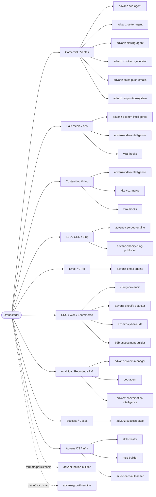

# Advanz OS — Router de Orquestación Agéntica

> **Qué es esto:** el mapa maestro que conecta **el trabajo real** (las sesiones de chat/code de Advanz) con **las skills que lo gobiernan**. Un agente orquestador lee este archivo, identifica el área de negocio de la tarea y **cita/invoca la skill correcta** (`Skill(skill="anthropic-skills:<nombre>")`).
>
> **Regla de oro:** este archivo **cita** skills, no las modifica. Nada de lo que funciona hoy se toca — las skills viven en el marketplace `anthropic-skills`, no en este repo.

`as-of: 2026-09-16` · `owner: Operaciones@advanz.cl` · `estado: vivo`

---

## TL;DR

- **134 sesiones** auditadas → colapsadas 8 vacías (`matiascs-*`), estructuradas el resto en **9 áreas de negocio**.
- Cada área tiene **1 skill primaria** (la que dispara) + **skills de apoyo** + **capa transversal** (formato/persistencia).
- El orquestador enruta por **trigger de intención**, no por cliente: primero *qué tipo de trabajo es*, luego *para qué cliente*.
- Clientes activos detectados: **AmazingCare** (dominante), **nad / nad+**, **Marê Swimwear**, **Kite**, **Vanguard STT**.

---

## Índice

1. [Mapa del sistema](#mapa-del-sistema)
2. [Tabla de enrutamiento agéntico](#tabla-de-enrutamiento-agéntico)
3. [Áreas de negocio → skills](#áreas-de-negocio--skills)
4. [Capa transversal (siempre activa)](#capa-transversal-siempre-activa)
5. [Sesiones colapsadas / a consolidar](#sesiones-colapsadas--a-consolidar)
6. [Cómo lo usa el orquestador](#cómo-lo-usa-el-orquestador)

---

## Mapa del sistema

---

## Tabla de enrutamiento agéntico

El orquestador dispara la **skill primaria** según el trigger. Todas se invocan con `Skill(skill="anthropic-skills:<nombre>")`.

| Si la tarea es… (trigger) | Área | Skill primaria | Skills de apoyo |
|---|---|---|---|
| "prepárame call / qué pitch / carga lead / pipeline" | Comercial | `advanz-cco-agent` | `advanz-closing-agent`, `advanz-conversation-intelligence` |
| "qué le respondo a este lead / cold open / DM" | Comercial | `advanz-setter-agent` | `advanz-cco-agent` |
| "discovery / cerrar reserva / cerrar contrato / objeción" | Comercial | `advanz-closing-agent` | `advanz-cco-agent` |
| "generar contrato / anexo / pasar cotización a contrato" | Comercial | `advanz-contract-generator` | `advanz-closing-agent` |
| "correo de cierre / follow-up / recuperar deal / envío propuesta" | Comercial | `advanz-sales-push-emails` | `advanz-closing-agent` |
| "cómo va el funnel de Advanz / estado de canales / prendo-apago canal" | Adquisición | `advanz-acquisition-system` | `advanz-project-manager` |
| "campaña Meta/Google / creativos / optimizar cuentas / SKU / ROAS" | Paid Media | `advanz-ecomm-intelligence` | `advanz-video-intelligence`, `viral-hooks` |
| "analiza estos videos / guiones UGC / escalar ad / hooks de video" | Contenido/Video | `advanz-video-intelligence` | `viral-hooks`, `kite-voz-marca` |
| "voz de marca Kite / carruseles Kite" | Contenido | `kite-voz-marca` | `advanz-video-intelligence` |
| "diagnóstico SEO / GEO / rankear en ChatGPT / schema / PDP" | SEO/GEO | `advanz-seo-geo-engine` | `advanz-shopify-blog-publisher` |
| "publicar blog en Shopify / blog salud/YMYL / FAQ schema" | SEO/Blog | `advanz-shopify-blog-publisher` | `advanz-seo-geo-engine` |
| "flujos de email / Klaviyo / carrito / welcome / win-back" | Email | `advanz-email-engine` | `advanz-ecomm-intelligence` |
| "auditoría CRO / puntos de fuga / qué toco sin romper / Clarity" | CRO | `clarity-cro-audit` | `advanz-shopify-detector` |
| "analiza esta tienda / qué apps usa / destripa competidor" | CRO/Bench | `advanz-shopify-detector` | `ecomm-benchmark-agent` |
| "auditoría cyber / evento cyber ecommerce" | CRO | `ecomm-cyber-audit` | `advanz-ecomm-intelligence` |
| "calculadora / quiz / lead magnet / assessment" | CRO/Captura | `b2b-assessment-builder` | `web-artifacts-builder` |
| "cómo va el equipo / tablero / sprint / backlog / bloqueado" | PM | `advanz-project-manager` | `coo-agent` |
| "metelo al tablero / crea la tarea / cierre semanal" | PM | `coo-agent` | `advanz-project-manager` |
| "procesa esta call de cliente activo / temperatura / churn" | Inteligencia | `advanz-conversation-intelligence` | `fathom-agent` |
| "caso de éxito / hito de cliente / arma la pieza" | Success | `advanz-success-case` | `advanz-notion-builder` |
| "aplícame el growth engine / diagnóstico / qué le falta a X" | Diagnóstico | `advanz-growth-engine` | `advanz-ecomm-intelligence` |
| "investigación de mercado / 7 maletas / buyer persona" | Research | `7-maletas` | `advanz-ecomm-intelligence` |
| "crea una skill / conecta un MCP / arma board Miro" | OS/Infra | `skill-creator` / `mcp-builder` / `miro-board-autosetter` | — |

---

## Áreas de negocio → skills

<!-- Cada área lista: skill primaria, skills de apoyo, y las sesiones históricas que le pertenecen. -->

### 1. Comercial / Ventas
- **Primaria por etapa:** `anthropic-skills:advanz-cco-agent` (estrategia/pipeline) · `anthropic-skills:advanz-setter-agent` (front funnel) · `anthropic-skills:advanz-closing-agent` (cierre)
- **Apoyo:** `anthropic-skills:advanz-contract-generator`, `anthropic-skills:advanz-sales-push-emails`, `anthropic-skills:advanz-acquisition-system`
- **Sesiones:** Mare Swimwear discovery call · Objeciones Maré Swimwear

### 2. Paid Media / Ads
- **Primaria:** `anthropic-skills:advanz-ecomm-intelligence` (estrategia/benchmarks de ads ecomm)
- **Apoyo:** `anthropic-skills:advanz-video-intelligence`, `anthropic-skills:viral-hooks`
- **Nota:** el analizador Meta Ads vive fuera del marketplace (repos `SkillsMeta` y `advanz-paid-media-marketplace`); tratarlos como fuente de datos, no como skill del marketplace.
- **Sesiones:** Campaña Fiestas Patrias AmazingCare · Revisión sistema aprobación anuncios · Agente Jefe de campañas · Agente Sistema de Ads · Auditoría Google Ads AmazingCare · Optimización cuentas múltiples SKU · Ecommerce columnas Meta Ads · Mason Care auditoría ads · Copywriting Meta+Google fiestas patrias · Nuevos ads para nad · Análisis videos nad para Meta · (+9)

### 3. Contenido / Creativo / Video
- **Primaria:** `anthropic-skills:advanz-video-intelligence`
- **Apoyo:** `anthropic-skills:viral-hooks`, `anthropic-skills:kite-voz-marca`, `anthropic-skills:theme-factory`, `anthropic-skills:web-artifacts-builder`
- **Sesiones:** Sistema visual Kite CARRUSELES · Agente Contenido Reels · Contenido SOP (×4) · HTML sistema creativo nad · UGC videos flash sale · Guion de grabación · Clasificar videos Amazing · (+8)

### 4. SEO / GEO / Blog
- **Primaria:** `anthropic-skills:advanz-seo-geo-engine`
- **Apoyo:** `anthropic-skills:advanz-shopify-blog-publisher`
- **Sesiones:** Agente Head of SEO/GEO · Reporte SEO con Search Console · Conexión blog a GHL · Blog lipedema y electrolitos · Estrategia de blogs · Blog traffic derivation

### 5. Email / CRM
- **Primaria:** `anthropic-skills:advanz-email-engine`
- **Apoyo:** `anthropic-skills:advanz-ecomm-intelligence`
- **Sesiones:** (canal emergente — Web scraping y envío de correos automatizado; UTM tracking parcialmente)

### 6. CRO / Web / Landing / Ecommerce build
- **Primaria:** `anthropic-skills:clarity-cro-audit`
- **Apoyo:** `anthropic-skills:advanz-shopify-detector`, `anthropic-skills:ecomm-cyber-audit`, `anthropic-skills:b2b-assessment-builder`, `anthropic-skills:ecomm-benchmark-agent`, `anthropic-skills:ecomm-scraping-cl`
- **Sesiones:** Ecommerce Builder · Lander Cyber + Quizz · Funnel landing + VSL Cyber · Nad+ product page HTML · Auditoría Shopify · Auditoría clarity amazingcare · Copiar ecommerce Shopify · Análisis ecommerce Vanguard STT · Unificar CRO · (+ `advanz-shopify-leadmagnet.html` de este repo)

### 7. Analítica / Reporting / PM
- **Primaria:** `anthropic-skills:advanz-project-manager` · `anthropic-skills:coo-agent`
- **Apoyo (calls):** `anthropic-skills:advanz-conversation-intelligence`, `anthropic-skills:fathom-agent`
- **Formatos:** `anthropic-skills:xlsx`, `anthropic-skills:pptx`, `anthropic-skills:pdf`, `anthropic-skills:docx`
- **Sesiones:** Amazing Care command center · Dashboard AmazingCare · War room cybermonday · Agente Reporting Master · Reporte semanal cliente · Cierre de mes agosto · Calculadora de costos · Fichas de rentabilidad

### 8. Success / Casos de éxito
- **Primaria:** `anthropic-skills:advanz-success-case`
- **Apoyo:** `anthropic-skills:advanz-notion-builder`
- **Sesiones:** (activar cuando cliente llegue a hito — hoy sin sesión dedicada)

### 9. Advanz OS / Infra / Skills / MCP
- **Primaria:** `anthropic-skills:skill-creator` · `anthropic-skills:mcp-builder` · `anthropic-skills:miro-board-autosetter`
- **Apoyo:** `anthropic-skills:diagram-engine`, `anthropic-skills:web-artifacts-builder`
- **Sesiones:** Advanz OS (×5) · Catálogo de Skills · Auditoría skills marketplace (×3) · Advanz Skills System Phase 2 (×5) · Conectar MCP ecommerce/magnific · Accesos MCP · Miro autosetter · App dashboard architecture · (+ librerías dev)

---

## Capa transversal (siempre activa)

Estas skills **no dependen del área**; el orquestador las encadena en cualquier flujo:

| Skill | Cuándo se encadena |
|---|---|
| `anthropic-skills:advanz-notion-builder` | Siempre que se persista/edite en Notion (formato escaneable canónico) |
| `anthropic-skills:advanz-growth-engine` | Marco de diagnóstico transversal para cualquier propuesta ecommerce |
| `anthropic-skills:humanizer` | Antes de entregar copy escrito, para quitar señales de IA |
| `anthropic-skills:token-efficient` | En tareas largas/multi-agente para no reventar contexto |
| `anthropic-skills:doc-coauthoring` | Al redactar docs/specs/propuestas estructuradas |

**Orden canónico de un flujo:** `growth-engine` (diagnóstico) → skill de área (ejecución) → `humanizer` (pulido copy) → `advanz-notion-builder` (persistencia).

---

## Sesiones colapsadas / a consolidar

### Colapsadas (archivadas) el 2026-09-16 — vacías, autogeneradas
`matiascs-memoized-sparrow`, `matiascs-squishy-unicorn`, `matiascs-keen-raccoon`, `matiascs-serialized-flamingo`, `matiascs-async-possum`, `matiascs-enumerated-fog`, `matiascs-happy-crane`, `matiascs-flickering-matsumoto`
(+ 5 `matiascs-*` ya estaban archivadas de antes.)

### A consolidar (NO archivadas — pueden tener trabajo; revisar antes)
- **"Advanz Skills System: Phase 2 planning"** — 5 sesiones duplicadas. Canónica sugerida: la más reciente (2026-09-10). Las otras 4 → revisar y archivar.
- **"Auditoría de skills del marketplace Advanced"** — 3 sesiones. Canónica: la más reciente. Las otras → archivar.
- **"Contenido SOP"** — 4 sesiones. Consolidar bajo un único hilo de Contenido SOP.

> No se archivaron por respetar *"sin romper nada funcional hoy"*: pueden contener decisiones. Consolidar solo tras confirmar.

---

## Cómo lo usa el orquestador

1. **Clasifica la tarea** por el trigger de la [tabla de enrutamiento](#tabla-de-enrutamiento-agéntico) (tipo de trabajo primero, cliente después).
2. **Invoca la skill primaria** con `Skill(skill="anthropic-skills:<nombre>")`. Si hay ambigüedad de etapa (comercial), decide por el verbo: *"qué digo"* → setter; *"qué significa/pitch"* → cco; *"cerrar"* → closing.
3. **Encadena apoyo + capa transversal** según el orden canónico.
4. **Persiste** el resultado con `advanz-notion-builder` (formato) en la base Notion del área.
5. **Nunca** edita el contenido de una skill; solo la cita/invoca.

<!-- Fin del router. Editar este archivo cuando nazca una skill o un área nueva; nunca duplicar lógica de skill aquí. -->
